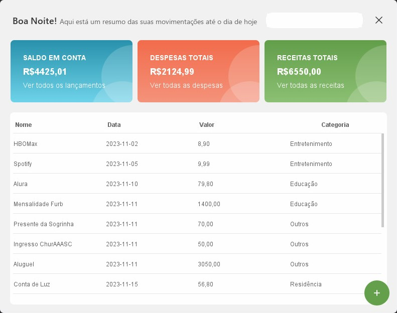
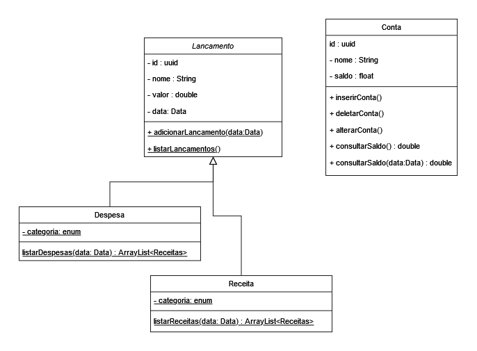

 
 <a href="#sobre">Sobre</a>  • 
 <a href="#requisitos">Requisitos</a>  •  
 <a href="#diagrama">Diagrama</a>  • 
 <a href="#licenc-a">Licença</a>  •  
 <a href="#autor">Autor</a>
 
 # 💸 DinDin
#### Seu novo app desktop para controle financeiro

Trabalho final para a disciplina de Programação Orientada a Objetos da FURB, segundo semestre. 
A entrega deverá ser realizada até dia <b>26/11/2023</b>. 
Apresentação do trabalho no dia: 30/11/2023<b>?</b> 

 
<a name="sobre"/>

## :bulb: Sobre o projeto

O objetivo do trabalho é implementar um programa em Java Desktop, com interface gráfica de usuário (GUI), afim de ser utilizado para controlar as receitas e despesas domésticas de uma pessoa.

#### REFERENCIAS

_ https://dribbble.com/shots/18527461-App-Despesas-planejadas  
_ https://dribbble.com/shots/16247633-bills-dashboard  
_ https://dribbble.com/shots/14722427-Dashboard  

#### TELINHA (ainda não finalizada)

  
  
Imagem da homepage do projeto

 
<a name="requisitos"/>

## :books: Requisitos Funcionais e Não-Funcionais

Tendo em mente que receitas são todos os recebimentos que a pessoa obtém e são classificadas em recebimento de salário, décimo
terceiro, férias e outras receitas. As despesas são gastos que a pessoa tem e são classificadas em gastos com pagamento
de alimentação, transporte, residência, saúde, educação, entretenimento e outras despesas.

O programa deve atender aos seguintes <b>requisitos funcionais</b>:
1) Incluir receitas. Uma receita deve ser categorizável e deve ser possível informar a data em que a receita ocorreu (ou
vai ocorrer);
2) Incluir as despesas. Uma despesa deve ser categorizável. Deve ser possível informar a data em que a despesa ocorreu
(ou vai ocorrer);
3) Consultar o saldo que a pessoa tem disponível até a data atual;
4) Consultar o saldo que a pessoa tem disponível, independente do período;
5) Listar todas as receitas lançadas;
6) Listar todas as despesas lançadas;
7) Listar todos os lançamentos (receitas e despesas) ordenados por data. A cada lançamento, exibir como aquele
lançamento impactou no saldo. Isto é, totalizar o saldo até aquele momento, assim como ocorre num extrato;

Também devem ser atendidos aos seguintes <b>requisitos não funcionais</b>:

9) Deve utilizar do conceito de herança;
10) Os dados submetidos pelo usuário devem ser gravados, bem como o programa deve recuperar os dados do disco
quando o programa for iniciado. Os arquivos de dados devem ser formatados em arquivo no formato .csv. Este
requisito será detalhado nas semanas seguintes.

 
<a name="diagrama"/>

## :chart_with_upwards_trend: Diagrama

  
  
Diagrama de classe feito no draw.io

 
<a name="licenc-a"/>

## :notebook_with_decorative_cover: Licença

Este projeto está sob licença MIT, para saber mais, acesse o arquivo [LICENSE](./LICENSE)

 
<a name="autor"/>

  <strong>Feito com :white_heart: por iara</strong>
   
  <a href="https://www.linkedin.com/in/iara/">entre em contato</a>

